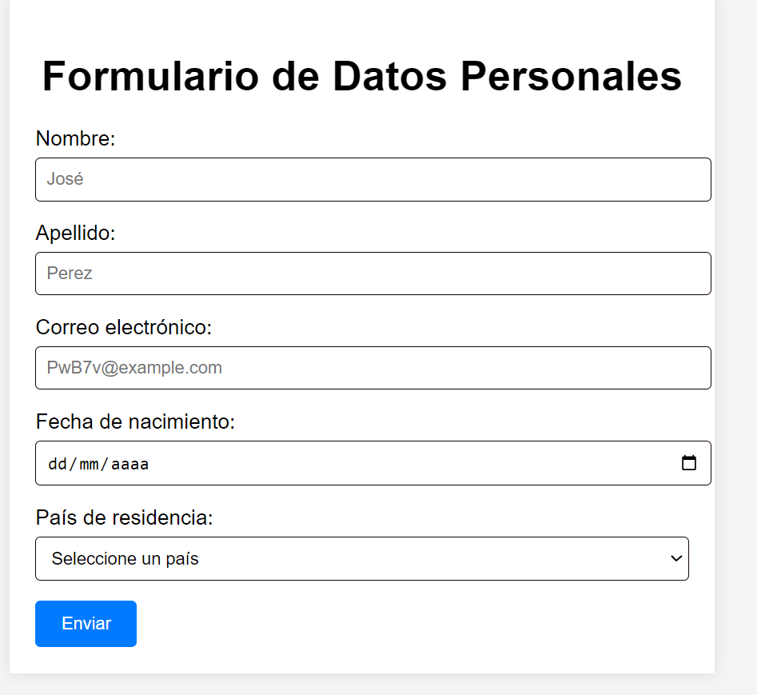

# Formulario de Datos Personales 💻

Este formulario de datos personales está diseñado para recopilar información crucial de los usuarios. Incluye campos estándar como nombre, apellido, correo electrónico, fecha de nacimiento y país de residencia, proporcionando una interfaz intuitiva y accesible para que los usuarios introduzcan sus datos de manera segura. Utiliza un diseño legible, asegurando que los usuarios puedan interactuar de manera efectiva. 

<h1 align="center"> </h1></=>
&nbsp;

&nbsp;

---
