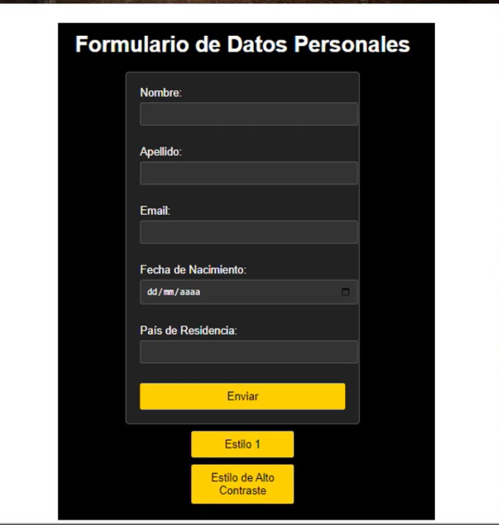

# Formulario de Datos Personales de Alto Contraste 💻

Los formularios de datos personales de alto contraste son versiones específicas diseñadas para mejorar la accesibilidad visual de usuarios que tienen dificultades para percibir o distinguir colores estándar. Estos formularios suelen utilizar combinaciones de colores de alto contraste, como blanco y negro, blanco y negro invertido, o combinaciones de colores brillantes y oscuros, para asegurar que los campos y etiquetas sean claramente distinguibles entre sí y fáciles de leer. Esto no solo facilita la interacción de personas con baja visión o ciertas discapacidades visuales, sino que también puede mejorar la experiencia general de usuario al hacer que la información sea más legible y comprensible para todos los usuarios.

<h1 align="center"></h1></=>
&nbsp;

&nbsp;

---
